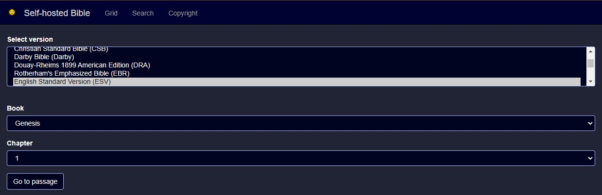
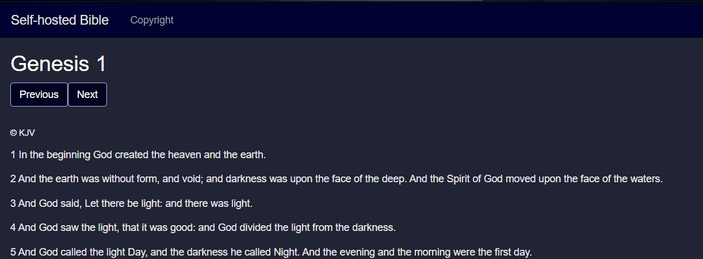
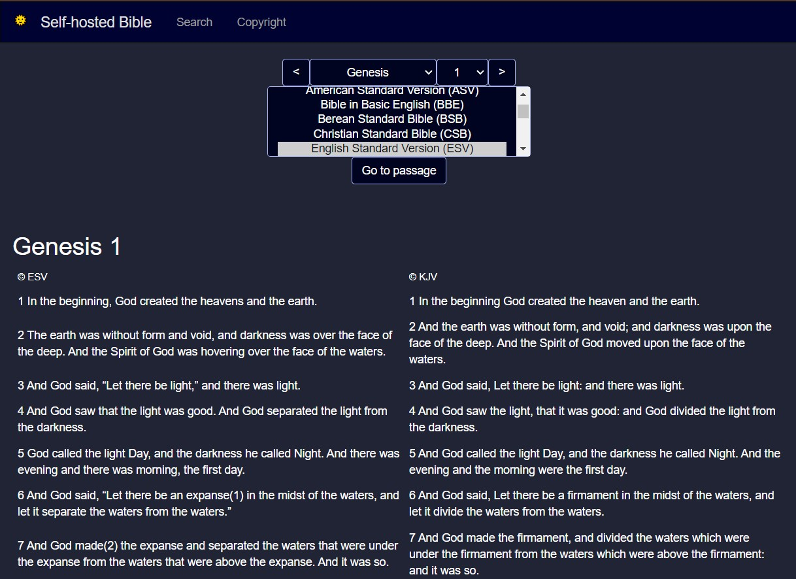

# [Self-hosted Bible](https://github.com/samhaswon/selfhosted-bible)
A self-hosted webapp of various Bible versions including the KJV, ESV, and ASV.

## Supported Architectures
| Architecture | Available | Tag    |
|:------------:|:---------:|--------|
|    x86-64    |     ✅     | latest |
|   arm64v8    |     ✅     | latest |
|   arm32v7    |     ✅     | latest |

## Examples
*Note: Screen shots taken in dark mode <br>
### Home page

### Single version reading

### Split version reading


# Instructions

## Generating an API key for authorized ESV access:
To start, make an account at [esv.org](https://www.esv.org/). After creating an account at [esv.org](https://www.esv.org/), create an API key at [https://api.esv.org/account/create-application/](https://api.esv.org/account/create-application/). Then place the key in [esv-api-key.txt](esv-api-key.txt) in place of "\<key-goes-here\>" for local installation or save the key for later if running in Docker.

## Running the application
<details>
    <summary>Locally</summary>

#### *Install Python 3*
This application requires Python 3 to run. To install it on Windows, download and run the installer at [python.org](https://www.python.org/downloads/). For Linux installation, you likely already have Python installed but maybe not pip. In this case, install python3 (if not already installed) and py3-pip (or whatever the package name is for Python 3 pip in your package manager) through your package manager. <br><br>
Then, verify Python was installed by running `python3 --version` on Linux or `py -version` on Windows.

For more detailed installation instructions, see [realpython.com](https://realpython.com/installing-python/).

#### *Install requirements*
```shell
pip3 install -r requirements.txt
```
#### *Execute:*
```shell
waitress-serve --port=5000 --call "main:create_app"
```
</details>

<details>
    <summary>In Docker</summary>

With docker, you have 2 options. You can either build the container yourself or pull it from [docker hub](https://hub.docker.com/r/samhaswon/self-hosted-bible)
#### Build the container
```shell
docker build -t self-hosted-bible .
``` 
##### (or) Pull the container
```shell
docker pull samhaswon/self-hosted-bible:latest
```

##### Run the container (detached)
Docker run
```shell
docker run -dp 5000:5000 \
       --restart=always \
       --name self-hosted-bible \
       -e ESV_API_KEY=<key-goes-here> \
       self-hosted-bible
```
Docker compose
```shell
version: '3'
services:
  self-hosted-bible-server:
    image: self-hosted-bible
    container_name: self-hosted-bible
    ports:
      - "5000:5000"
    restart: always
    environment:
      - ESV_API_KEY=<key-goes-here>
```
</details>

## *Navigate to the webpage*
To access a locally hosted version of the application, go to [localhost:5000](http://localhost:5000) or [127.0.0.1:5000](http://127.0.0.1:5000). To access the application running in Docker on another machine, go to <machine_ip>:5000 .

## Copyright Notice:
The code included in this repository is subject to the included license, but the content from external sources is not.

<details>
    <summary>ASV Notice</summary>

> Scripture quotations marked “ASV” are taken from the American Standard Version Bible (Public Domain).
</details>

<details>
    <summary>ESV Notice</summary>

>Scripture quotations marked “ESV” are from the ESV® Bible (The Holy Bible, English Standard Version®), copyright © 2001 by Crossway, a publishing ministry of Good News Publishers. Used by permission. All rights reserved. The ESV text may not be quoted in any publication made available to the public by a Creative Commons license. The ESV may not be translated into any other language.
>
>Users may not copy or download more than 500 verses of the ESV Bible or more than one half of any book of the ESV Bible.
</details>

<details>
    <summary>KJV Notice</summary>

> Rights in The Authorized Version of the Bible (King James Bible) in the United Kingdom are vested in the Crown and administered by the Crown’s patentee, Cambridge University Press. The reproduction by any means of the text of the King James Version is permitted to a maximum of five hundred (500) verses for liturgical and non-commercial educational use, provided that the verses quoted neither amount to a complete book of the Bible nor represent 25 per cent or more of the total text of the work in which they are quoted, subject to the following acknowledgement being included:
> Scripture quotations from The Authorized (King James) Version. Rights in the Authorized Version in the United Kingdom are vested in the Crown. Reproduced by permission of the Crown’s patentee, Cambridge University Press
> When quotations from the KJV text are used in materials not being made available for sale, such as church bulletins, orders of service, posters, presentation materials, or similar media, a complete copyright notice is not required but the initials KJV must appear at the end of the quotation.
> Rights or permission requests (including but not limited to reproduction in commercial publications) that exceed the above guidelines must be directed to the Permissions Department, Cambridge University Press, University Printing House, Shaftesbury Road, Cambridge CB2 8BS, UK (https://www.cambridge.org/about-us/rights-permissions) and approved in writing.
</details>

## Credits
Credit to [@bibleapi](https://github.com/bibleapi/bibleapi-bibles-json) for KJV and ASV original JSON
