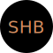
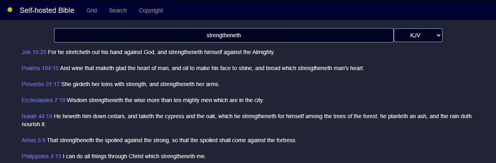
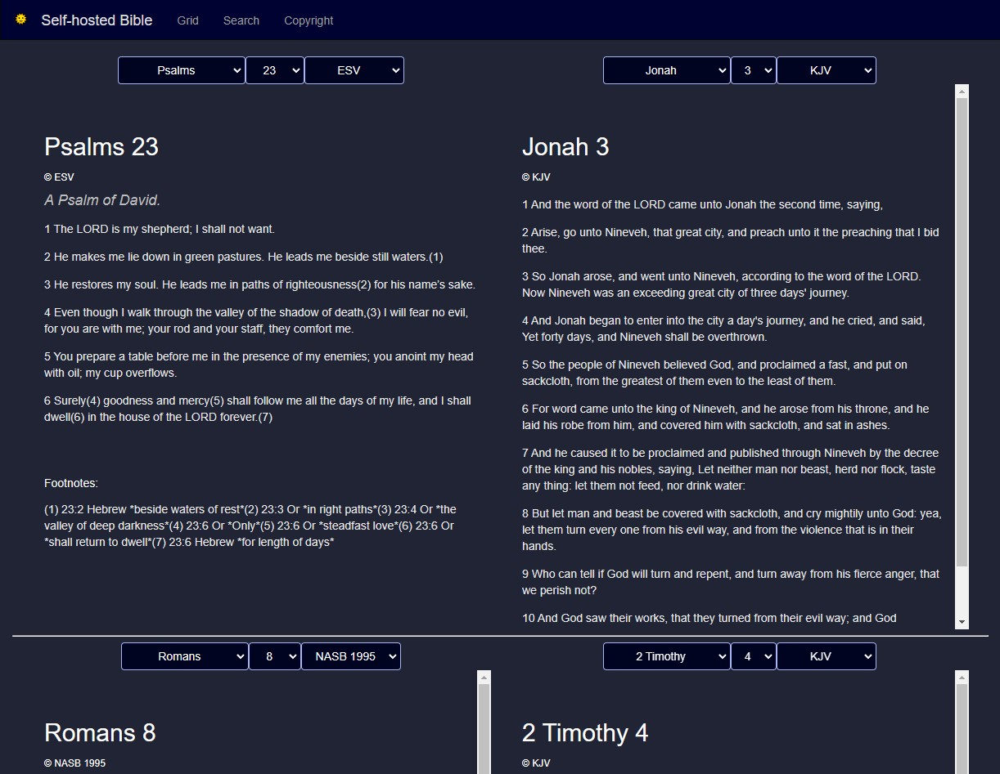

# [Self-hosted Bible](https://github.com/samhaswon/selfhosted-bible)


A self-hosted webapp of various Bible versions including the KJV, ESV, and ASV.

## Supported Architectures
| Architecture | Available | Tag    |
|:------------:|:---------:|--------|
|    x86-64    |     ✅     | latest |
|   arm64v8    |     ✅     | latest |
|   arm32v7    |     ✅     | latest |
|   arm32v6    |     ✅     | latest |
|     i386     |     ✅     | latest |

## Examples
*Note: Screen shots taken in dark mode <br>
### Home page

### Single version reading

### Split version reading

### Search 

### Passage Grid


# Instructions

## Generating an API key for authorized ESV access (optional):
To start, make an account at [esv.org](https://www.esv.org/). After creating an account at 
[esv.org](https://www.esv.org/), create an API key at 
[https://api.esv.org/account/create-application/](https://api.esv.org/account/create-application/). Then place the key 
in [esv-api-key.txt](esv-api-key.txt) in place of "\<key-goes-here\>" for local installation or save the key for later 
if running in Docker.

## Running the application
<details>
    <summary>Locally</summary>

#### *Install Python 3*
This application requires Python 3 to run. To install it on Windows, download and run the installer at 
[python.org](https://www.python.org/downloads/). For Linux installation, you likely already have Python installed but 
maybe not pip. In this case, install python3 (if not already installed) and py3-pip (or whatever the package name is for 
Python 3 pip in your package manager) through your package manager. <br><br>
Then, verify Python was installed by running `python3 --version` on Linux or `py -version` on Windows.

For more detailed installation instructions, see [realpython.com](https://realpython.com/installing-python/).

#### *Install requirements*
```shell
pip3 install -r requirements.txt
```
#### *Execute:*
```shell
waitress-serve --port=5000 --call "main:create_app"
```
</details>

<details>
    <summary>In Docker</summary>

With docker, you have 2 options. You can either build the container yourself or pull it from 
[docker hub](https://hub.docker.com/r/samhaswon/self-hosted-bible)
#### Build the container
If you choose this option, replace `samhaswon/self-hosted-bible:latest` with `self-hosted-bible` in the Docker run 
command or Docker compose file.
```shell
docker build -t self-hosted-bible .
``` 
##### (or) Pull the container
```shell
docker pull samhaswon/self-hosted-bible:latest
```

##### Run the container (detached)
**Note** The volume, `/usr/src/app/bibles/json-bibles` is to give the container a persistent cache between versions <br><br>
Docker run
```shell
docker run -dp 5000:5000 \
       --restart=always \
       --name self-hosted-bible \
       -e ESV_API_KEY=<key-goes-here> \
       -v <host_path>:/usr/src/app/bibles/json-bibles
       samhaswon/self-hosted-bible:latest
```
Docker compose
```yaml
version: '3'
services:
  self-hosted-bible-server:
    image: samhaswon/self-hosted-bible:latest
    container_name: self-hosted-bible
    ports:
      - "5000:5000"
    restart: always
    volumes:
      - /path/to/json/bibles:/usr/src/app/bibles/json-bibles
    environment:
      - ESV_API_KEY=<key-goes-here>
```
</details>

## *Navigate to the webpage*
To access a locally hosted version of the application, go to [localhost:5000](http://localhost:5000) or 
[127.0.0.1:5000](http://127.0.0.1:5000). To access the application running in Docker on another machine, go to 
<machine_ip>:5000 .

## Copyright Notice:
The code included in this repository is subject to the included license, but the content from external sources is not.

<details>
    <summary>ACV Notice</summary>

> A Conservative Version (ACV) was translated by Dr. Walter L. Porter. The ACV is in the public domain. 
> The translation can be accessed online at http://www.stillvoices.org.
> 
> Distribution license: Public Domain

</details>

<details>
    <summary>AKJV Notice</summary>

> This is a translation of the Bible based on the original King James Version. It is a simple word for word update from the King James English. Care has been taken to change nothing doctrinally, but to simply update the spelling and vocabulary. The grammar has not changed the grammar because that could alter the doctrine.<br><br> 
> The American King James version of the Bible was placed into the public domain on November 8, 1999.<br><br>
> <b>Michael Peter (Stone) Engelbrite</b><br><br>
> You may use it in any manner you wish: copy it, sell it, modify it, etc.<br>
> You can't copyright it or prevent others from using it.
> A special thanks to Tye Rausch and Eve Engelbrite who helped tremendously on this project.
> You can't claim that you created it.</p>

<a href="https://www.angelfire.com/al4/allenkc/akjv/" target="_blank" rel="noopener noreferrer">Homepage</a>
</details>

<details>
    <summary>AMP Notice</summary>

> Scriptures marked AMP are taken from the AMPLIFIED BIBLE (AMP): Scripture taken from the AMPLIFIED® BIBLE, Copyright 
> © 1954, 1958, 1962, 1964, 1965, 1987 by the Lockman Foundation Used by Permission. 
> (<a href="https://www.lockman.org/">www.Lockman.org</a>)
</details>

<details>
    <summary>ASV Notice</summary>

> Scripture quotations marked “ASV” are taken from the American Standard Version Bible (Public Domain).
</details>

<details>
    <summary>BBE Notice</summary>

> The Bible in Basic English is in the public domain. It was printed in 1965 by Cambridge Press in England without a copyright notice. When distributed in the United States, it fell into the public domain according to the UCC convention of that time.
> 
> The Bible in Basic English uses “Basic English”, a simple form of the English language with a vocabulary of fewer than 1000 words.
</details>

<details>
    <summary>BSB Notice</summary>

> The Holy Bible, Berean Standard Bible, BSB is produced in cooperation with <a href="//biblehub.com">Bible Hub</a>, 
> <a href="//discoverybible.com">Discovery Bible</a>, <a href="//openbible.com">OpenBible.com</a>, and the Berean Bible 
> Translation Committee. This text of God's Word has been <a href="https://creativecommons.org/publicdomain/zero/1.0/"> 
> dedicated to the public domain</a>.
</details>

<details>
    <summary>CSB Notice</summary>

> Scripture quotations marked CSB have been taken from the Christian Standard Bible®, Copyright © 2017 by Holman Bible 
> Publishers. Used by permission. Christian Standard Bible® and CSB® are federally registered trademarks of Holman Bible 
> Publishers.
</details>

<details>
    <summary>Darby Bible Notice</summary>

> The Darby Bible was first published in 1890 by John Nelson Darby, an Anglo-Irish Bible teacher associated with the early years of the Plymouth Brethren. Darby also published translations of the Bible in French and German.
> 
> J. N. Darby's purpose was, as he states in the preface to his English New Testament, to make a modern translation for the unlearned who have neither access to manuscript texts nor training and knowledge of ancient languages of the Scriptures. Darby's translation work was not intended to be read aloud. His work was for study and private use. In his own oral ministry he generally used the English KJV Bible.
> 
> This Bible is in the public domain in the United States.

</details>

<details>
    <summary>Douay-Rheims 1899 American Edition Notice</summary>

> Scripture quotations marked "DRA" have been taken from the Douay-Rheims 1899 American Edition (Public Domain).
</details>

<details>
    <summary>EBR Notice</summary>

> Scripture quotations marked "EBR" have been taken from Rotherham's Emphasized Bible, Public Domain.
</details>

<details>
    <summary>ESV Notice</summary>

>Scripture quotations marked “ESV” are from the ESV® Bible (The Holy Bible, English Standard Version®), copyright © 2001 
> by Crossway, a publishing ministry of Good News Publishers. Used by permission. All rights reserved. The ESV text may 
> not be quoted in any publication made available to the public by a Creative Commons license. The ESV may not be 
> translated into any other language.
>
> Users may not copy or download more than 500 verses of the ESV Bible or more than one half of any book of the ESV Bible.
</details>

<details>
    <summary>GNV Notice</summary>

Geneva Bible (1599)
> This digital copy is freely available world-wide, with no copyright restrictions, courtesy of eBible.org and many others.
</details>

<details>
    <summary>KJV Notice</summary>

> Rights in The Authorized Version of the Bible (King James Bible) in the United Kingdom are vested in the Crown and 
> administered by the Crown’s patentee, Cambridge University Press. The reproduction by any means of the text of the 
> King James Version is permitted to a maximum of five hundred (500) verses for liturgical and non-commercial 
> educational use, provided that the verses quoted neither amount to a complete book of the Bible nor represent 25 per 
> cent or more of the total text of the work in which they are quoted, subject to the following acknowledgement being 
> included:
> 
> Scripture quotations from The Authorized (King James) Version. Rights in the Authorized Version in the United Kingdom 
> are vested in the Crown. Reproduced by permission of the Crown’s patentee, Cambridge University Press
> When quotations from the KJV text are used in materials not being made available for sale, such as church bulletins, 
> orders of service, posters, presentation materials, or similar media, a complete copyright notice is not required but 
> the initials KJV must appear at the end of the quotation.
> Rights or permission requests (including but not limited to reproduction in commercial publications) that exceed the 
> above guidelines must be directed to the Permissions Department, Cambridge University Press, University Printing 
> House, Shaftesbury Road, Cambridge CB2 8BS, UK (https://www.cambridge.org/about-us/rights-permissions) and approved 
> in writing.
</details>

<details>
    <summary>LSV Notice</summary>

> Scripture quotations marked “LSV” are taken from the Literal Standard Version (Creative Commons Attribution-ShareAlike 
> license). See more <a href="https://www.lsvbible.com/">here</a> 
</details>

<details>
    <summary>MSG Notice</summary>

> Scripture quotations marked "MSG" are from THE MESSAGE. Copyright © by Eugene H. Peterson 1993, 2002, 2005, 2018. Used 
> by permission of NavPress. All rights reserved. Represented by Tyndale House Publishers, Inc. 
</details>

<details>
    <summary>NASB (1995) Notice</summary>

> Scripture quotations taken from the (NASB®) New American Standard Bible®, Copyright © 1960, 1971, 1977, 1995 by The 
> Lockman Foundation. Used by permission. All rights reserved. <a href="lockman.org">lockman.org</a>
</details>

<details>
    <summary>NET Notice</summary>

> The Scriptures quoted are from the NET Bible® https://netbible.com copyright ©1996, 2019 used with permission from 
> Biblical Studies Press, L.L.C. All rights reserved
>
> To see the NET Bible® study tool go to https://netbible.org.
</details>

<details>
    <summary>NIV Notice</summary>

> The Holy Bible, New International Version®, NIV® Copyright © 1973, 1978, 1984, 2011 by Biblica, Inc.® Used with 
> permission. All rights reserved worldwide.
</details>

<details>
    <summary>NKJV Notice</summary>

> Scriptures marked NKJV are taken from the NEW KING JAMES VERSION (NKJV): Scripture taken from the NEW KING JAMES 
> VERSION®. Copyright© 1982 by Thomas Nelson, Inc. Used by permission. All rights reserved. 

<a href="https://www.thomasnelson.com/about-us/permissions/#permissionBiblesmartphone">See more info about usage of the NKJV here</a>
</details>

<details>
    <summary>NLT Notice</summary>

> Scriptures marked NLT are taken from the HOLY BIBLE, NEW LIVING TRANSLATION (NLT): Scriptures taken from the HOLY 
> BIBLE, NEW LIVING TRANSLATION, Copyright© 1996, 2004, 2007 by Tyndale House Foundation. Used by permission of Tyndale 
> House Publishers, Inc., Carol Stream, Illinois 60188. All rights reserved. Used by permission.
</details>

<details>
    <summary>RNKJV Notice</summary>

> Scripture quotations marked “RNKJV” are taken from the Restored Name King James Version (Public Domain).
</details>

<details>
    <summary>RSV Notice</summary>

> Scriptures marked RSV are taken from the REVISED STANDARD VERSION (RSV): Scripture taken from the REVISED STANDARD 
> VERSION, Grand Rapids: Zondervan, 1971.
</details>

<details>
    <summary>RWV Notice</summary>

> Scriptures marked "RWV" are taken from the Revised Webster Version (1833), Public Domain.
</details>

<details>
    <summary>UKJV Notice</summary>

> Freely distributable. Public Domain. True to the Authorized Version. Updated for modern reading using today's computing technology. Completed on 25th December, 2000. A Christmas gift to the world.<br>
> This translation/update is in the Public Domain, so feel free to copy, publish, and use it. No permission in whatsoever form is needed. You already have 100% permission to publish, copy, and distribute the Updated King James Version (UKJV) as much as you want to in any form. However the author of "Translator" requests that the following be observed: -<br>
> i) A credit line with the following words "I love Jesus (UKJV)." To be stated in the copyright page of the work that involves the UKJV.<br>
> ii) No modifications to the UKJV, this does NOT include typographical corrections or adding of studies notes, comments and layouts modifications, which are essential to any publications. However NO addition of footnotes that indicates the preference of other manuscripts superiority in any form are allowed, e.g. "Most reliable manuscripts does not have so and so", "The verse x-x are not found in Vaticanus/Sinaiticus" etc.
</details>

<details>
    <summary>WEB Notice</summary>

- Note: Only canonical books available
> Scriptures marked WEB are taken from THE WORLD ENGLISH BIBLE (WEB): WORLD ENGLISH BIBLE, public domain.
</details>

<details>
    <summary>YLT Notice</summary>

> Scripture quotations marked “YLT” are taken from The Young’s Literal Translation Bible (Public Domain).
</details>

<details>
    <summary>BTX Notice</summary>

> Biblia Textual<br>
> © 1999 por la Sociedad Bíblica Iberoamericana Todos los derechos reservados Derechos internacionales registrados<br>
> No se permite su reproducción (con excepción de citas breves), ni su incorporación a un sistema informático, ni su transmisión en cualquier forma o por cualquier medio, sea este electrónico, mecánico, reprográfico, gramofónico u otro sin autorización escrita de los titulares del copyright.
</details>

<details>
    <summary>RV1960 Notice</summary>

> In 1960,
>     the British and Foreign Bible Society and the American Bible Society jointly published the popular revision of the Version Reina-Valera. 
>     This version has been the basic text of the Spanish Protestant Church for generations.
>     It is the most beloved translation of Spanish-speaking Christians
>     because it retains the traditional style of the Spanish language.<br><br>
> 
> Scriptures marked as RV1960 are taken from the Reina-Valera 1960 version.
>     Copyright © Sociedades Bíblicas en América Latina;
>     Copyright © renewed 1988 United Bible Societies.
>     Used by permission.<br><br>
> 
> Las porciones marcadas como RV1960 son tomadas de la versión Reina-Valera 1960 Copyright © 1960 Sociedades Bíblicas en América Latina;
>     Copyright © renovado 1988 Sociedades Bíblicas Unidas.
>     Usado con permiso.<br><br>
> 
> The text of the Reina-Valera 1960 version (RV1960)
>     appearing on or deriving from this or any other web page is for personal use only.
>     The RV1960 text may be quoted in any form (written, visual, electronic or audio) up to & inclusive of five hundred (500) verses without written permission, providing the verses quoted do not amount to fifty (50%) of a complete book of the Bible nor do the verses account for twenty-five percent (25%) or more of the total text of the work in which they are quoted.<br><br>
> 
> This permission is contingent upon an appropriate copyright acknowledgment.
>     Any use of the RV1960 shall be governed by above policy and shall be solely restricted to noncommercial,
>     personal study purposes.<br><br>
> 
> For any other use, please address your inquiries to:<br><br>
> 
> > American Bible Society<br>
> > Office of Latino Affairs<br>
> > Attn. Permissions Department<br>
> > 300 NW 82nd Avenue, Suite 505A<br>
> > Plantation, Florida, 33324<br>
> > http://www.americanbibleespanol.org.
</details>

## Credits
Credit to [@bibleapi](https://github.com/bibleapi/bibleapi-bibles-json) for KJV and ASV original JSON
